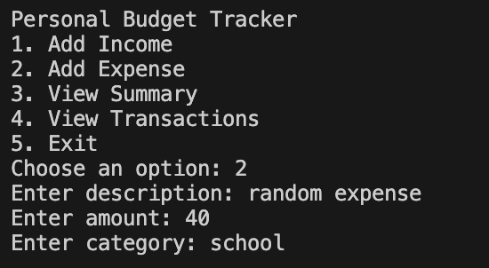
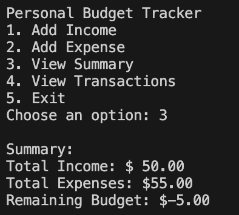

# Finance Tracker in Python for Code In Place

Overall Description
- 

This simple program is designed to allow users to track their expenditures and finances through implemented mathematical operations through using Python.

Context
- 
Code In Place is a learning course made by Stanford University for those who want to venture into coding by using an interactive program that encourages users to practice their skills and try new approaches. This project is the final project for this short course that brings together some of the lessons applied in class. 

Inspiration/Mission
- 

As a current college student, being able to create your budget and manage your own finances can be pretty daunting. Many students at Code In Place may be international students, or first-gen. This project is aimed at raising awareness for being financially responsible and creating reasonable budgets. 

Overview 
- 
1. The user can open the file from their github desktop app or copy the code into a python interpreter. They will be greeted with the options to: Add Income, Add Expense, View Summary, View Transactions, Exit. They will be prompted to choose an option based on the number associated with it on the list. Once the user types one of the numbers into the console to select the option they would like, more items will appear. 

2. In the case of entering an expense, the user will be asled to first enter a description of the expense. Then they will be asked to enter an amount, and finally a category. 

3. Once this is done, the user will be back to the personal budget tracker main display menu. 

4. There they will be able to choose either to enter another expense or access any of the options. If they choose to check their summary, it will print the total income, total expenses, and remaining budget into the console. 

5. All of these events are triggered by different conditionals, as well as the absolute function on python to calculate the remaining budget. 

Installation
- 
Install it using Github desktop. If you do not already have Github desktop, make sure to download the appropriate version depending on the system you are working with (Mac or Windows). 

Limitations
- 
Seeing as Karel and Python are very similar but still have some aspects that differ, this project utilizes functions that would have been difficult to write on the Karel platform.

Contact
- 
kmartine@macalester.edu

Thanks
- 
Thanks to section leader Surangana A for her guidance throughout this course. 

